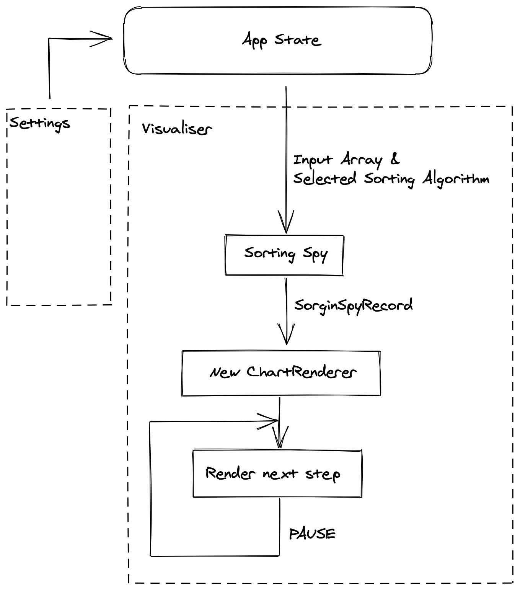

#🕵️ Sorting algorithms visualiser 

[](https://app.netlify.com/sites/przemkow-sorting-algorithms-visualisation/deploys)
## URL:
[http://przemkow-sorting-algorithms-visualisation.netlify.app/](http://przemkow-sorting-algorithms-visualisation.netlify.app/)

## Description:
Sorting algorithms visualiser created to provide human-readable illustration of what happens under the hood of different sorting algorithms!


## Project details:
Project written in TypeScript, SCSS and HTML with Parcel used to generate final build. No external dependencies are used.

### Directory structure:
```
src/
├assets - static assets
├helprs - helper functions
├sorting-algorithms - List of sorting algorithms. 
├sorting-spies - Sorting spies which implements SpyOptions interface and returns SortingSpyRecord
│  ├Manual - Manual Spy - requires adding logic to sorting algoritm which manualy marks every step performed by an algorithm. Results with higher precision.
│  ├Proxy - Proxy Spy - automatic spy which basing on Proxy interface monitors changes perofmend on input array. No need to modify Sorting algorithm. Less precise results. 
├store - Simple Redux-like store implementation based on observer & store immutability patterns.
├view - Presentational layer
```

### Overall architecture diagram:

